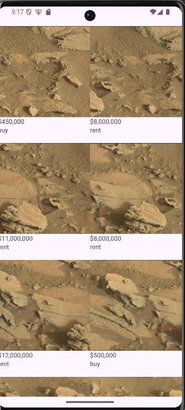
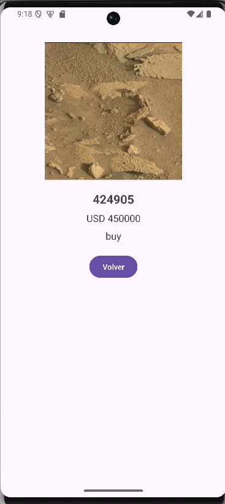

# 🚀 Mars Real Estate App — Android (Kotlin)

Aplicación Android desarrollada en **Kotlin** que consume datos desde una API REST (Mars Real Estate) y los almacena localmente usando **Room**, implementando arquitectura **MVVM**.

---

## 📱 Descripción

Esta app permite visualizar propiedades disponibles en Marte 🪐, mostrando imágenes, precios y tipo de propiedad (venta/arriendo),(buy / rent).

Los datos son obtenidos desde una API externa y persistidos localmente, permitiendo una mejor gestión y visualización eficiente.

---

## 🧠 Arquitectura

El proyecto sigue el patrón:

**MVVM (Model - View - ViewModel)**

* **Model**

  * `MarsRealState.kt` → Modelo de datos (Entity + API)
  * `MarsApi.kt` → Endpoints Retrofit
  * `MarsRepository.kt` → Manejo de datos (API + Room)

* **ViewModel**

  * `MarsViewModel.kt` → Lógica de negocio y manejo de estados

* **View**

  * `FirstFragment.kt` → Lista de propiedades
  * `SecondFragment.kt` → Detalle de propiedad
  * `AdapterMars.kt` → RecyclerView Adapter

---

## 🔗 Tecnologías utilizadas

* Kotlin
* Retrofit (consumo API REST)
* Room Database (persistencia local)
* LiveData
* ViewModel
* Coroutines
* RecyclerView + GridLayout
* Glide (carga de imágenes)

---

## 🌐 API utilizada

* Endpoint:
  `https://android-kotlin-fun-mars-server.appspot.com/realestate`

* Datos obtenidos:

  * `id`
  * `price`
  * `type` (buy / rent)
  * `img_src`

---

## ⚙️ Funcionamiento

1. La app realiza una petición a la API usando Retrofit.
2. Los datos se almacenan en Room Database.
3. El ViewModel expone los datos mediante LiveData.
4. El Fragment observa los cambios y actualiza la UI automáticamente.
5. El usuario puede seleccionar un item para ver el detalle.

---

## 🖼️ Interfaz

* Lista en formato **Grid (2 columnas)**



* Visualización de:

  * Imagen
  * Precio formateado
  * Tipo de propiedad
* Navegación a detalle con información ampliada



---

## 🧪 Buenas prácticas implementadas

* Separación de responsabilidades (MVVM)
* Persistencia local con Room
* Uso de corrutinas para operaciones asíncronas
* Observación reactiva con LiveData
* Manejo de errores en consumo API

---

## 📦 Estructura del proyecto

```
com.example.marsapipm
│
├── Model
│   ├── Local
│   │   ├── MarsDatabase.kt
│   │   └── MarsDao.kt
│   ├── Remote
│   │   ├── MarsApi.kt
│   │   └── MarsRealState.kt
│   └── MarsRepository.kt
│
├── View
│   ├── FirstFragment.kt
│   ├── SecondFragment.kt
│   ├── AdapterMars.kt
│   └── MainActivity.kt
│
├── ViewModel
│   └── MarsViewModel.kt
```

---

## 🚧 Mejoras futuras

* 🔹 Filtros por tipo (buy / rent)
* 🔹 Búsqueda por precio
* 🔹 Manejo de estados de carga (Loading / Error)
* 🔹 Caché inteligente (sin recargar API innecesariamente)
* 🔹 Integración con gráficos (ej: distribución de precios)
* 🔹 Navegación con Navigation Component

---

## 📥 Instalación

1. Clonar repositorio:

```bash
git clone https://github.com/TU_USUARIO/TU_REPO.git
```

2. Abrir en Android Studio

3. Ejecutar en emulador o dispositivo físico

---

## 👩‍💻 Autor

**DP**


---

## ⭐ Notas

Este proyecto demuestra el uso integrado de:

* Consumo de APIs
* Persistencia local
* Arquitectura limpia en Android

Ideal como base para aplicaciones escalables orientadas a datos.


